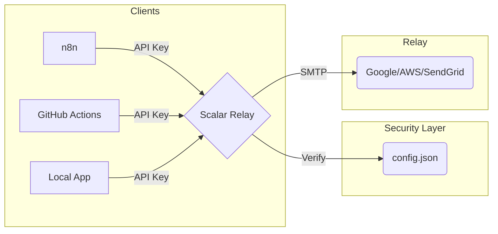

# Architecture | Scalar Relay

Scalar Relay acts as a **Decoupled SMTP Bridge**.

## 🧩 The Pattern
In modern distributed systems (n8n, CI/CD, Microservices), storing SMTP credentials in every node is a security risk. If one node is compromised, your global SMTP credentials are leaked.

**Scalar Relay solves this by:**
1. Centrally managing your SMTP server credentials.
2. Exposing a stateless HTTP API protected by lightweight API keys.
3. Decoupling the "Sending Logic" from the "Credential Storage".

## 🔐 Security Model
- **Master Key**: Generated during setup. Only this key can manage other keys and view logs.
- **Tenant Keys**: Limited keys for specific services. Compromise of a tenant key only grants access to sending emails via that specific bridge, not your global credentials.
- **Stateless Logs**: Logs are stored in RAM (In-memory). A server restart clears all history for maximum privacy.
